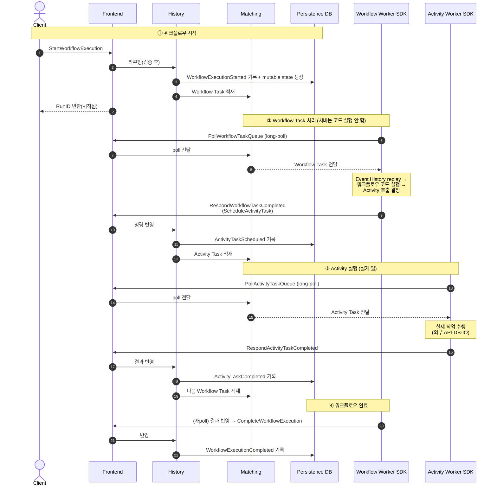
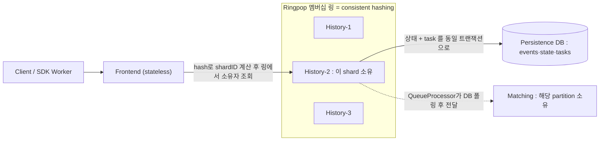

# R0. Temporal 아키텍처 기초 (infra/devops 관점)

설계/배포 전, 운영자가 반드시 알아야 할 Temporal의 동작 원리와 서버 내부 구조를 빠르게 정리한다.
(출처는 문서 하단. 공식 docs.temporal.io 기준, 2026-06 확인)

---

## 0. 멘탈 모델 한 줄

> **Temporal 서버는 사용자 코드를 실행하지 않는다.** 서버는 "워크플로우의 상태와 이벤트 히스토리를 영속화하고, 할 일(Task)을 Task Queue에 쌓아두는 오케스트레이터"일 뿐이다. 실제 비즈니스 코드(Workflow/Activity)는 **Worker**(= 우리가 SDK로 짜서 띄우는 별도 프로세스)가 Task Queue를 long-poll 해서 가져가 실행한다.

핵심은 **Durable Execution**: 워크플로우의 모든 상태 전이가 append-only **Event History**로 DB에 기록된다. Worker가 죽었다 살아나도 이벤트 히스토리를 **replay**해서 정확히 멈췄던 지점부터 이어간다. → 그래서 DB(persistence)가 Temporal의 심장이자 병목.

---

## 1. 실제 운용 서비스 (배포 단위 / 바이너리 관점) ⭐

> **가장 중요한 사실**: Temporal 서버는 **단일 바이너리 `temporal-server`**(이미지 `temporalio/server`) 하나다.
> Frontend·History·Matching·Worker는 *별개 프로그램이 아니라* **같은 바이너리를 어떤 role로 켜느냐**의 차이일 뿐이다.
> - **프로덕션**: role별로 **4개의 Deployment**로 분리 배포(각 pod이 `temporal-server`를 해당 role로 실행). 서로 멤버십(Ringpop)으로 발견하고 네트워크로 통신.
> - **개발용**: `temporal server start-dev`는 서버(4 role)+SQLite+UI를 **한 프로세스**에 묶는 진짜 all-in-one. `temporalio/auto-setup` 이미지는 서버(4 role 단일 프로세스)에 **스키마 자동 생성·기본 namespace 등록**까지 해주지만 DB·UI는 별도 컨테이너. 둘 다 **프로덕션 금지**.

### 실제로 뜨는 서비스들

| # | 서비스 (배포 단위) | 실행 바이너리 / 이미지 | k8s 리소스 | 역할 | stateful | 외부노출 | 이 repo가 관리? |
|---|--------------------|------------------------|------------|------|:---:|:---:|:---:|
| 1 | **Frontend** | `temporal-server` (role=frontend) · `temporalio/server` | Deployment + Service | 게이트웨이(인증·rate limit·라우팅) | ✗ | ✅ gRPC 7233 | ✅ |
| 2 | **History** | `temporal-server` (role=history) · `temporalio/server` | Deployment | Event History·상태·timer 영속, **샤딩** | △¹ | ✗ 내부 | ✅ |
| 3 | **Matching** | `temporal-server` (role=matching) · `temporalio/server` | Deployment | Task Queue 매칭/라우팅 | △¹ | ✗ 내부 | ✅ |
| 4 | **Worker (internal)** | `temporal-server` (role=worker) · `temporalio/server` | Deployment | 서버 내부 시스템 워크플로우 | △¹ | ✗ 내부 | ✅ |
| 5 | **Web UI** | `temporalio/ui` | Deployment + Service(+Ingress) | 조회·디버깅 UI | ✗ | ✅ 내부망/SSO | ✅ |
| 6 | **Schema setup** | `temporalio/admin-tools` (`temporal-sql-tool` 등) | **Job** (Helm hook) | DB 스키마 생성/업그레이드 (1회성) | n/a | — | ✅ |
| 7 | **Main DB** (persistence) | Cassandra / PostgreSQL / MySQL | StatefulSet **또는 관리형(RDS/Aurora)** | 워크플로우 상태·Task·메타 | ✓ | 내부 | △² |
| 8 | **Visibility store** | Elasticsearch/OpenSearch **또는 SQL** | StatefulSet/관리형 | 워크플로우 검색·필터 | ✓ | 내부 | △² |
| 9 | (선택) **관측** | Prometheus / Grafana | Deployment/StatefulSet | 메트릭·대시보드 | ✓ | 내부 | △³ |
| 10 | **SDK Worker** (우리 비즈니스 코드) | 우리가 만든 앱 이미지(Go/Java/TS/…) | Deployment | **Workflow/Activity 코드 실행** | ✗ | — | ❌ **앱팀 소유 / 별 repo** |

- ¹ **History/Matching/Worker는 PVC 없는 Deployment**다. "stateful"은 *메모리+DB에 shard/queue 상태를 들고 동작*한다는 논리적 의미이지, pod에 디스크가 붙는 게 아니다. (그래서 StatefulSet 아님)
- ² in-cluster로 띄우면 이 repo가 관리, 관리형(RDS 등)이면 외부 → **R4 결정**.
- ³ 조직 공용 모니터링 스택이면 외부, 클러스터 전용이면 이 repo.

### "그래서 History/Matching/Worker는 어느 서버에서 도나?"
- 각자 **자기 pod 집합(Deployment)**으로 따로 뜬다. 물리적으로 다른 노드에 흩어질 수 있고, 같은 머신 보장은 없다. 서로 **네트워크(gRPC + 멤버십)**로 통신.
- **Activity Worker는 #10(SDK Worker) 안에서 실행**된다 — 서버가 아니라 우리 앱. Frontend(7233)로 접속해 Task Queue를 long-poll.
  - 한 SDK Worker 프로세스가 Workflow Task와 Activity Task를 **둘 다** polling 할 수도, Task Queue를 나눠 **Workflow Worker / Activity Worker를 별도 Deployment**로 분리할 수도 있다(스케일 분리용).

### ⚠️ "Worker"가 두 개다 — 가장 헷갈리는 지점

이름만 같고 **완전히 다른 두 가지**다. 둘 다 "Task Queue를 polling 해서 워크플로우 코드를 실행"하기 때문에 같은 이름이 붙었을 뿐, *누구 코드를, 어디서* 돌리느냐가 다르다.

| | **Worker Service (internal)** | **SDK Worker (우리 워커)** |
|---|---|---|
| 정체 | `temporal-server` 바이너리의 **4번째 role** (서버 컴포넌트) | 우리가 **SDK로 만든 별도 앱** |
| 누가 만드나 | Temporal이 기본 제공 | **우리(개발팀)가 작성** |
| 어디서 실행 | Temporal 클러스터 **안** (이 repo가 배포) | 클러스터 **밖**, 별도 Deployment (**앱팀 repo**) |
| 무슨 코드 실행 | Temporal **시스템 워크플로우** (archival·batch·schedule·replication 등) | **우리 비즈니스** Workflow/Activity |
| 어떤 Task Queue | 서버 내부 system task queue | 우리가 정한 task queue |
| **우리 코드 돌리나?** | ❌ **절대 안 함** | ✅ **우리 코드가 도는 유일한 곳** |
| 끄면/없으면 | 스케줄·배치·archival 등 일부 **서버 기능** 멈춤 | **우리 워크플로우가 진행 안 됨**(task 적체) |

> **왜 서버 안에 Worker가 있나?** Temporal은 자기 기능(스케줄러·배치·아카이벌·네임스페이스 복제 등)을 *자기 자신의 워크플로우*로 구현한다. 그 시스템 워크플로우를 실행할 워커가 필요해서 내부 Worker Service를 둔 것 — "자기 도그푸딩".
>
> **소통 팁**: 회의에서 그냥 "워커"라고 하면 거의 항상 **SDK Worker(우리 앱)**다. 서버 컴포넌트를 가리킬 땐 반드시 **"internal worker service"**라고 명시.
>
> 참고: 지난 절의 **Activity Worker / Workflow Worker**는 둘 다 **SDK Worker(우리 앱)**의 분화일 뿐, internal Worker Service와는 무관하다.

---

## 2. 워크플로우 실행 흐름 (서버 단위 시퀀스)

아래 시퀀스에서 **서버측(1~4)**은 이 repo가 배포하는 Temporal 클러스터, **WW/AW**는 클러스터 밖 우리 앱(SDK Worker)이다.

**읽는 법 요약**
- 모든 외부 통신은 **Frontend(7233) 한 곳**으로만. History/Matching은 외부에 안 보임.
- **Matching은 "큐"**: History가 Task를 넣고(push), Worker가 long-poll로 가져감(pull). 메시지 브로커(SQS/Kafka)가 아니라 매칭 큐.
- **상태의 source of truth는 항상 DB의 Event History**. 모든 단계가 기록되어 replay 가능.
- 서버는 시종일관 "기록·적재·라우팅"만 하고, **비즈니스 코드는 WW/AW(우리 앱)에서만** 돈다.

---

## 3. 서버 내부 = 4개 서비스 (책임/스케일 관점)

§1이 "무엇이 뜨나"라면, 여기는 "각자 무슨 책임이고 어떻게 스케일하나".

| 서비스 | 역할 | 상태성 | 스케일 |
|--------|------|--------|--------|
| **Frontend** | inbound 게이트웨이 — rate limit / 인증 / 검증 / 라우팅 | Stateless | 수평(샤딩 없음) |
| **History** | 워크플로우 mutable state·Event History·timer·내부 큐 영속화. **History Engine**이 동작 | Stateful(샤딩) | 수평(History Shard 분배) |
| **Matching** | 사용자 Task Queue 호스팅, Worker↔Task 매칭 | Stateful | 수평(Task Queue 분배) |
| **Worker (internal)** | 서버 내부 시스템 워크플로우 — replication, archival, schedule, 배치 등 | Stateful | 수평 |

**실제 프로덕션 배포 비율 예시**(공식 문서): Frontend 5 / History 15 / Matching 17 / Worker 3. → History·Matching이 부하의 핵심.

---

## 4. 분산·확장은 어떻게 되나 (코디네이터 없이) ⭐

> **의문**: 앞단 LB도, Redis도, ZooKeeper/etcd도 없는데 frontend/history/matching을 여러 대 띄우면 *누가 일을 나눠주나?*
>
> **답 세 줄**:
> 1. **gossip 멤버십 링 + consistent hashing** 으로 "어느 노드가 어느 shard/partition을 소유하는지"를 결정 (외부 코디네이터 불필요).
> 2. **DB의 조건부 쓰기(RangeID 펜싱)** 로 "한 shard는 한 노드만 쓴다"를 보장 (Redis 분산 락 대체).
> 3. **큐 자체는 DB 안**에 있다 (상태와 같은 트랜잭션으로 적재 = transactional outbox).

### 4-1. 멤버십 — 노드들이 서로를 찾는 법
- 각 Temporal 노드는 기동 시 자기 identity를 **persistence DB의 `cluster_membership` 테이블**에 기록(`UpsertClusterMembership`)하고 ~1분 주기로 갱신. 다른 노드는 `GetActiveClusterMembers`로 살아있는 멤버를 읽어 부트스트랩한다.
- 그 위에서 **Ringpop**(SWIM gossip + consistent-hash ring 라이브러리)이 멤버 상태를 가십으로 공유하고 role별 해시 링을 유지.
- 즉 **DB = 시드/멤버 레지스트리, Ringpop = 라이브 가십 + 해시 링**. → ZooKeeper/etcd 같은 별도 코디네이터가 없는 이유. (Temporal은 향후 Ringpop 대체 예정이라고 밝힘)

### 4-2. History — shard을 노드에 분배 + 단일 소유 보장
- 키스페이스 = 고정된 `NumHistoryShards`(예: 512). 워크플로우 → `hash(namespaceID + workflowID) % NumHistoryShards` → shardID.
- 각 History 호스트의 **ShardController**가 Ringpop 링(consistent hashing)으로 "내가 소유할 shard 집합"을 계산. 노드 추가/제거 시 shard가 자동 재분배(failover).
- **RangeID 펜싱**: 각 shard는 DB에 단조 증가 `RangeID`를 가짐. 새 소유 노드가 shard를 잡으면 RangeID를 +1 → 옛 소유자(낡은 RangeID)의 쓰기는 DB에서 **거부**됨. 따라서 **split-brain 없이 항상 단일 writer**. 이게 Redis 락을 대체하는 핵심 = **DB의 compare-and-swap**.

### 4-3. 큐는 DB 안에 있다 (Transactional Outbox)
- History가 워크플로우 상태를 바꿀 때 **같은 DB 트랜잭션**에서 (a) Event 추가 (b) mutable state 갱신 (c) **Transfer Task**(즉시 실행, 예: "activity task를 matching에 넣어라")·**Timer Task**(지연 실행)를 함께 적재 — 원자적.
- 각 shard의 **QueueProcessor** goroutine이 DB의 ready task를 폴링해 처리(→ Matching 호출 등). 처리 위치(ack level)를 DB에 주기 저장해 재시작 복구.
- 그래서 질문의 답: **"큐 = persistence DB의 tasks 테이블"이 맞다.** Redis/Kafka 아님. 상태와 큐가 한 트랜잭션이라 유실/중복 없이 일관적.

### 4-4. Matching — task queue를 파티셔닝
- Task Queue는 처리량을 위해 **partition**(기본 4개)으로 쪼갠다. 각 partition은 consistent hashing으로 matching 호스트에 배정(재배정·storage load/unload 가능).
- **Sync match**: 폴링 중인 Worker가 있으면 task를 메모리로 즉시 전달(저지연, task 본문 DB 기록 생략 가능). 없으면 **DB에 backlog로 저장** 후 poller가 오면 전달.
- 부모-자식 partition 계층 + forwarding으로 "task 있는 partition ↔ poller 있는 partition"을 맞춘다.

### 4-5. Frontend — stateless, 내부 라우팅
- Frontend는 소유권이 없는 stateless. 클라이언트/Worker 연결은 **gRPC 클라이언트 LB / k8s Service**로 분산.
- 받은 요청을 **멤버십 링으로 조회**해 → 해당 shard를 소유한 History, 또는 해당 partition을 소유한 Matching 호스트로 **내부 gRPC 라우팅**. (앞단에 별도 "스마트 게이트웨이"가 있는 게 아니라, frontend가 링을 보고 라우팅한다.)

### 4-6. 운영 함정 — `NumHistoryShards`는 불변
- **클러스터 생성 후 변경 불가(immutable).** 바꾸려면 새 클러스터 + 마이그레이션 → **배포 전 반드시 결정**.
  - 소규모 prod 권장 **512**, 대형도 4,096 넘는 경우 드묾(1~128K 테스트됨). 권장 비율 **History 1프로세스당 shard ~500**.
  - 과하면 History CPU/메모리 낭비 + DB 압력↑.
- 👉 **서비스별 독립 클러스터**면 서비스마다 규모를 예측해 `numHistoryShards`를 따로 정해야 한다(작은 서비스에 4096은 낭비).

---

## 5. Persistence (Temporal의 심장) — main store + visibility store

Temporal은 **두 개의 영속 계층**을 쓴다.

### 5-1. Main(default) store — 필수
워크플로우 상태(mutable state + append-only history), Task, Namespace 메타데이터 저장.

| DB | 지원 버전 | 비고 |
|----|-----------|------|
| Cassandra | 3.11, 4.0 | 전통적 기본, 높은 쓰기 처리량 |
| PostgreSQL | 13.x~16.x | 관리형(RDS/Aurora) 친화 |
| MySQL | 5.7, 8.0.19+ | PG와 유사 |
| SQLite | 3.x | **개발/테스트 전용** |

### 5-2. Visibility store — "실행 중 워크플로우 목록/검색"
| 모드 | 백엔드 | 메모 |
|------|--------|------|
| **Standard visibility** | main DB 그대로 | 기본 필터만, 검색 약함 |
| **Advanced visibility** | v1.20+ **SQL(PG12+/MySQL8.0.17+/SQLite)** 또는 **Elasticsearch/OpenSearch** | 커스텀 Search Attribute, SQL-like List Filter. v1.19 이하는 ES 필수 |

> 프로덕션에서 워크플로우가 많으면 공식 권장은 **Elasticsearch/OpenSearch** (visibility 부하 흡수). 소규모면 SQL advanced visibility로 ES 없이 단순화 가능 → **R3 결정 포인트**.

### 5-3. 스키마 관리
- DB 스키마는 **서버 버전에 종속** → 서버 업그레이드 시 스키마 마이그레이션 필요.
- 도구: `temporal-sql-tool`(SQL), `temporal-cassandra-tool`(Cassandra)로 schema setup/upgrade. (`temporalio/admin-tools` 이미지에 포함)
- `auto-setup` 이미지는 **개발 전용** (프로덕션 금지). 프로덕션은 schema setup을 별도 Job/Helm hook으로 (§1 #6).

---

## 6. 클러스터 내부 동작 (k8s 네트워킹 관점)

- **멤버십/서비스 디스커버리**: Temporal은 gossip 링(**Ringpop**)으로 노드를 발견하고 shard/task-queue 소유권을 분배. → History·Matching pod끼리 안정적인 intra-cluster 통신 필요(headless Service / pod 간 직접 통신).
- **기본 포트(default, 차트 값과 대조 필요)**:
  - Frontend gRPC: **7233** (외부 노출 대상)
  - History 7234 / Matching 7235 / Worker(internal) 7239 (내부)
  - 멤버십 6933~6939 대역
  - Web UI: 8080(temporal-ui) / 8233(`start-dev` 번들)
- 외부로 노출하는 건 **Frontend(7233)뿐**. 나머지는 클러스터 내부 ClusterIP. 클라이언트/SDK Worker는 Frontend로만 접속.

---

## 7. 알아둘 부가 컴포넌트

| 컴포넌트 | 무엇 |
|----------|------|
| **Temporal Web UI** (`temporalio/ui`) | 워크플로우 조회/디버깅 UI. 별도 Deployment. |
| **Namespace** | 클러스터 내 논리 격리 단위(테넌트). 등록 필요, **retention period**를 namespace별로 설정. |
| **Multi-cluster replication (Global Namespace)** | 클러스터 간 비동기 복제로 HA/DR. self-hosted 가능하나 운영 복잡. |
| **Nexus** | (2025 GA) **격리된 namespace 간** Temporal 호출 연결. ⚠️ **self-hosted는 단일 클러스터 내에서만 지원** (클러스터 간 X — 우리 토폴로지에 직접 영향, §9 참고). |
| **Schedules / Batch** | 크론성 워크플로우, 대량 작업. Worker(internal) 서비스가 처리. |

---

## 8. infra/devops 체크포인트 (요약)

- **스케일 축**: 부하의 핵심은 History·Matching, 그리고 그 뒤의 **DB**. Frontend는 stateless라 쉬움.
- **병목**: 거의 항상 persistence DB. shard 수·DB IOPS·연결 수가 한계.
- **불변 결정**: `numHistoryShards`(배포 전 확정), persistence DB 종류.
- **관측성**: 서버/SDK 모두 **Prometheus 메트릭** 노출 → Grafana 대시보드 필수. (공식 차트에 Prometheus/Grafana 번들 옵션 있음)
- **업그레이드**: 마이너 버전 **건너뛰기 금지**, 스키마 마이그레이션 동반, 롤링.
- **시크릿**: DB 자격증명, (있다면) mTLS 인증서 → 시크릿 관리 방식 별도 결정.
- **HA**: 각 서비스 다중 replica + DB HA(관리형이면 자동) + (필요시) multi-cluster replication.

---

## 9. 우리 결정(서비스별 독립 클러스터)에의 함의

[ADR 0003](../adr/0003-per-service-independent-clusters.md) = 서비스마다 독립 Temporal 클러스터. 위 구조에 비춘 결과:

- ✅ **강한 격리**: 서비스별로 `numHistoryShards`·DB·스케일·버전을 따로 최적화 가능.
- 💰 **비용 N배**: 각 클러스터가 (Frontend+History+Matching+Worker) + main DB + (선택)visibility store + 모니터링을 각각 필요로 함. 서비스 수만큼 곱해짐 → **R4 비용 추정 필수**.
- ⚠️ **Nexus 제약**: self-hosted Nexus는 **단일 클러스터 내 namespace 간**에서만 동작. 즉 **독립 클러스터로 나뉜 서비스 A↔B는 Nexus로 직접 연결 불가**. 서비스 간 Temporal-native 연동이 필요해지면 (a) multi-cluster replication, (b) 애플리케이션 레벨 통합, (c) 해당 서비스들만 한 클러스터+namespace로 묶기 중 선택해야 함. → **설계 시 "서비스 간 연동 요구가 있는가"를 먼저 확인**.
- 🔧 **표준화 필수**: 클러스터가 N개로 늘어나므로 `services/_template/` + ArgoCD ApplicationSet로 찍어내는 표준이 중요(이미 구조에 반영).

---

## Sources
- [Temporal Server | docs.temporal.io](https://docs.temporal.io/temporal-service/temporal-server)
- [History Service 내부 (membership/shard/RangeID/queue) | github.com/temporalio/temporal](https://github.com/temporalio/temporal/blob/main/docs/architecture/history-service.md)
- [Matching Service 내부 (partition/sync match) | github.com/temporalio/temporal](https://github.com/temporalio/temporal/blob/main/docs/architecture/matching-service.md)
- [Ringpop (gossip + consistent hashing) | github.com/temporalio/ringpop-go](https://github.com/temporalio/ringpop-go)
- [Persistence | docs.temporal.io](https://docs.temporal.io/temporal-service/persistence)
- [Temporal Visibility | docs.temporal.io](https://docs.temporal.io/visibility)
- [Scaling Temporal: The basics | temporal.io](https://temporal.io/blog/scaling-temporal-the-basics)
- [Temporal Nexus is now generally available | temporal.io](https://temporal.io/blog/temporal-nexus-now-available)
- [Temporal Nexus | docs.temporal.io](https://docs.temporal.io/nexus)
